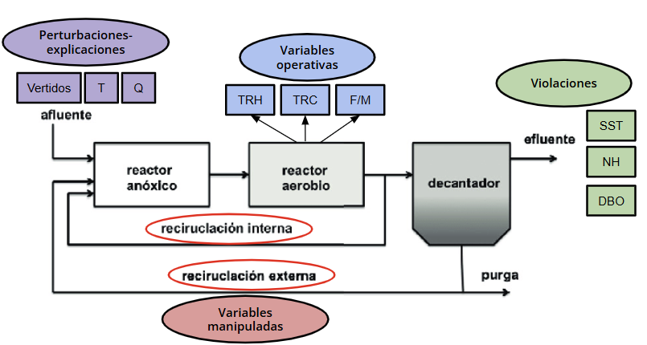
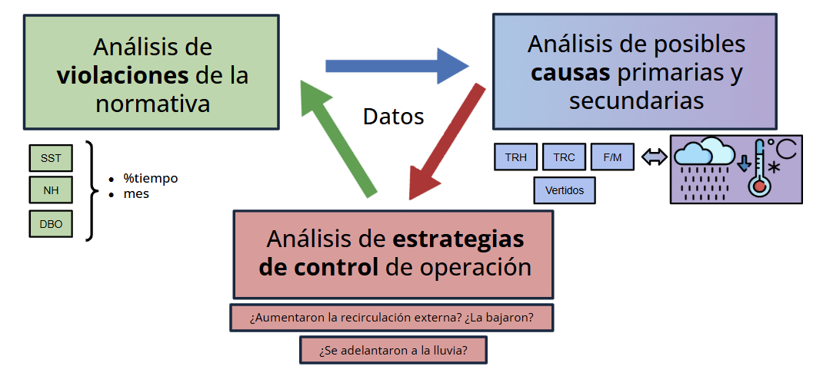
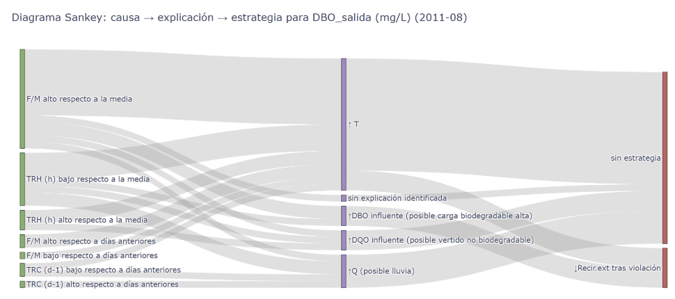

# 📦 bsm2-tools

**BSM2 Tools** es una librería de Python para analizar datos de simulaciones de plantas de tratamiento de aguas residuales basadas en el Benchmark Simulation Model No. 2 (BSM2). Incluye herramientas para cargar, visualizar y evaluar el desempeño de la planta y las violaciones regulatorias.

## 📘 ¿Qué es BSM2?

El **Benchmark Simulation Model No. 2 (BSM2)** es una herramienta de simulación ampliamente utilizada para plantas de tratamiento de aguas residuales (PTAR).  
Permite a investigadores e ingenieros probar estrategias de control, evaluar el desempeño operativo y optimizar procesos de tratamiento sin necesidad de datos en tiempo real de la planta.

En BSM2, un modelo dinámico simula los procesos biológicos y químicos de una EDAR, incluyendo:

- Características del afluente (por ejemplo, caudal, materia orgánica, formas de nitrógeno)
- Decantador primario
- Reactor de lodos activados
- Decantador secundario
- Manejo y digestión de lodos

Los datos generados por BSM2  pueden llegar a incluir docenas de datos de proceso cada minuto, típicamente almacenados como archivos `.csv` o `.mat`. Este módulo está diseñado para trabajar con un único dato diario por variable, ya que es lo que más sentido tiene a la hora de pensar en los datos que se pueden obtener en una planta real.

---

## 📂 Requisitos del CSV de entrada

Para utilizar correctamente las funciones del analizador, el archivo `.csv` de entrada **debe incluir, al menos,** lo siguiente:

- Una columna **`Día`** que contenga la fecha (01-03-2015).

- **Variables objetivo de salida**:

  Para realizar la detección de violaciones, tu conjunto de datos debe incluir **al menos una** de las siguientes columnas de calidad del efluente, que son comúnmente monitoreadas en plantas de tratamiento:

  - `DBO_salida (mg/L)` — Demanda Bioquímica de Oxígeno  
  - `DQO_salida (mg/L)` — Demanda Química de Oxígeno  
  - `SST_salida (mg/L)` — Sólidos Suspendidos Totales  
  - `Ntot_salida (mg/L)` — Nitrógeno Total  
  - `NH_salida (mg/L)` — Amonio  
  - `PT_salida (mg/L)` — Fósforo Total

  Estos parámetros se utilizan para identificar días en los que se excedieron los límites de vertido.  
  También puedes incluir otros indicadores de efluente si tu conjunto de datos los contiene (por ejemplo, `NO3_salida`, `PO4_salida`).

  > 🔧 Para especificar qué variable de salida deseas analizar, consulta la **sección de Personalización** más abajo.

  Debes conocer el umbral regulatorio para el parámetro que deseas analizar. Por ejemplo, el límite legal para DBO suele ser 25 mg/L.

- **Variables operativas** utilizadas para el análisis causal. Si no especificas ninguna variable, se analizarán las siguientes por defecto. Si deseas incluir variables operativas adicionales, se proporcionan instrucciones más adelante en este documento:
  - `F/M`  
  - `TRC (d-1)`  
  - `TRH (h)`  

- **Variables controladas**: Estas variables representan las principales **acciones del operador** utilizadas para mitigar desviaciones del proceso en las PTAR. Son esenciales para detectar si se aplicó alguna **estrategia de control reactiva** en respuesta a una violación. > ⚠️ Estas dos variables son **obligatorias** y deben estar incluidas en cada `.csv` que importes.
  - `Recir. Interna (m3/d)`  
  - `Recir. Externa (m3/d)`

- **Indicadores de perturbaciones del afluente** (estos también son **obligatorios**), tales como:
  - `Q (m3/d)`
  - `Temperatura (ºC)`
  - `DQO_brut (mg/L)`
  - `DBO_brut (mg/L)`
  - `SST_brut (mg/L)`
  - `NH_brut (mg/L)`

> ⚠️ **Importante:** Los nombres de las columnas deben coincidir exactamente como se muestran. Si tu conjunto de datos utiliza encabezados diferentes, deberás modificarlos (en los parámetros obligatorios al menos, además, siempre es recomendable poner las unidades).

> ⚠️ **Importante 2:** Dado que los requisitos de estructura son complejos, en la carpeta data/ se incluye un archivo CSV que cumple con todos los requerimientos y es compatible con todos los códigos presentados en este documento.

La imagen a continuación proporciona un resumen visual de las variables de entrada requeridas, sus categorías funcionales y su ubicación típica dentro del esquema de la planta.



---

## 🚀 Funcionalidades de la librería:

- Cargar y procesar archivos CSV de salida de BSM2
- Visualizar tendencias de afluente y efluente a lo largo del tiempo
- Detectar violaciones de límites de vertido ambiental
- Analizar relaciones causales entre configuraciones operativas y violaciones
- Visualizar causa → explicación → respuesta con diagramas de Sankey

## 🛠️ Instalación

Mediante este código, clonas el repositorio, creas un entorno cirtual e instalas la librería:

```bash
# Clona el repositorio oficial
git clone https://github.com/mariagcdf/bsm2-tools.git
cd bsm2-tools

# Crea y activa un entorno virtual
python -m venv .venv
source .venv/bin/activate  # En Windows: .venv\Scripts\activate

# Instala el paquete y sus dependencias
pip install .
cd bsm2-tools

```

## 📊 Módulo `analyzer` — Motor de detección de violaciones y análisis causal

La siguiente imagen proporciona una representación visual de las relaciones identificadas por el módulo analyzer:



El módulo `analyzer` es responsable de identificar violaciones regulatorias en conjuntos de datos de plantas de tratamiento (por ejemplo, simulaciones BSM2 o datos reales), y analizar posibles causas y respuestas operativas. Incluye:

- **Detección de violaciones**: Para parámetros clave de calidad del efluente (por ejemplo, DQO, DBO, SST, NT, NH₄⁺, PT), detecta días en los que los valores exceden los umbrales legales o de diseño.
- **Análisis causal**: Para cada violación, analiza:
  - **Causas directas**: basadas en el comportamiento anómalo de variables operativas (por ejemplo, baja edad del lodo, alta relación F/M) en comparación con tendencias históricas de corto plazo.
  - **Causas secundarias**: basadas en perturbaciones externas (por ejemplo, eventos de lluvia, cargas de materia orgánica o nitrógeno).
- **Detección de respuesta**: Verifica si se tomaron acciones operativas correctivas en los días siguientes (por ejemplo, aumento de recirculación interna).
- **Salida por consola:** : El analizador no solo devuelve un resumen de violaciones y sus causas, sino que también imprime una secuencia detallada, día a día, de los eventos detectados en la consola. Para cada día, muestra si ocurrió una violación, las causas sospechosas (por ejemplo, variables operativas anómalas o perturbaciones del afluente) y cualquier acción correctiva observada en los días siguientes. Esta salida paso a paso ayuda a los usuarios a comprender la progresión de eventos y respuestas a lo largo de la simulación o conjunto de datos.

En la siguiente imagen se observa la salida por consola habitual:


Recuerda: Este módulo está diseñado para trabajar con un único dato diario por variable.

### 🧠 Cómo llamar a la función analyzer, qué parámetros necesita:

```bash
# Paso 1: Ejecutar en PowerShell (terminal)

$env:PYTHONPATH="src"
python
```
```python
# Paso 2: Ejecutar dentro del intérprete de Python (copia directamente a partir de aquí):

from bsm2tools.loader import load_and_validate_csv
from bsm2tools.analyzer import analizar_violaciones

df = load_and_validate_csv("data/datos_simulados_planta_completo.csv")

violaciones_info = analizar_violaciones(
    df,
    columna_objetivo="DBO_salida (mg/L)",
    umbral=10,
    variables_causales=["F/M", "TRC (d-1)", "TRH (h)"],
    nombre_parametro="DBO",
    imprimir=True
)
```

## 🎯 Módulo `visualizer` — Diagrama de Sankey para violaciones y causas

En esta imagen se observa un ejemplo de visualizacion del Sankey:



El módulo `visualizer` proporciona una forma intuitiva de entender **por qué** ocurrieron violaciones de calidad del efluente y **cómo** respondió el sistema. Se basa en la salida del módulo `analyzer` y produce diagramas de Sankey que mapean:

- **Causas directas** (por ejemplo, baja edad del lodo, alta F/M)
- **Explicaciones secundarias** (por ejemplo, cargas de choque, caídas de temperatura)
- **Respuestas operativas** (por ejemplo, aumento de recirculación)

### 🧠 Cómo llamar a la función visualizer, qué parametros necesita

```bash
#OJO! Te puede preguntar si quieres graficar todo o un mes -> elige: todo (en este CSV no hay tantos datos)
#También te abrirá una página web con el diagrama.

# Paso 1: Ejecutar en PowerShell (terminal)

$env:PYTHONPATH="src"
python
```
```python
# Paso 2: Ejecutar dentro del intérprete de Python (copia directamente a partir de aquí):

from bsm2tools.loader import load_and_validate_csv
from bsm2tools.visualizer import graficar_sankey

# Cargar y analizar datos (desde el CSV que tengo subido en data)
df = load_and_validate_csv("data/datos_simulados_planta_completo.csv")

#Graficar
graficar_sankey(
    df,
    columna_objetivo="DBO_salida (mg/L)",
    umbral=10,
    variables_causales=["F/M", "TRC (d-1)", "TRH (h)"],
    nombre_parametro="DBO"
)
```
Todos estos parámetros son personalizables. Consulta la sección siguiente para más detalles.

## ⚙️ Personalización de parámetros y variables en bsm2-tools

Puedes adaptar el análisis y la visualización ajustando los siguientes parámetros:

---

### 1. `columna_objetivo` — Parámetro a monitorear para violaciones

Esta es la variable de calidad del efluente que deseas analizar (por ejemplo, DBO, NH₄⁺, PT).

**Ejemplos:**
- `"DBO_salida (mg/L)"` &nbsp;→&nbsp; Demanda Bioquímica de Oxígeno
- `"NH_salida (mg/L)"` &nbsp;→&nbsp; Amonio
- `"PT_salida (mg/L)"` &nbsp;→&nbsp; Fósforo Total

---

### 2. `umbral` — Umbral de violación

Este valor establece la concentración máxima aceptable antes de que se marque una violación.

**Ejemplos:**
- `25` &nbsp;→&nbsp; Para DBO (mg/L)
- `10` &nbsp;→&nbsp; Para NH₄⁺ (mg/L)
- `1` &nbsp;→&nbsp; Para PT (mg/L)

> **Nota:** El valor debe coincidir con las unidades de tu conjunto de datos (típicamente mg/L).

---

### 3. `variables_causales` — Variables operativas a analizar

Estas son variables que se sospecha influyen en las violaciones. Se revisan en busca de comportamientos anómalos en comparación con patrones históricos recientes.

### 🔧 Cómo incluir tus propias variables causales

Para realizar un análisis causal personalizado, proporciona tu propia lista de variables de proceso usando el argumento `variables_causales` al llamar a `graficar_sankey()` o `analizar_violaciones()`.

Sin embargo, las siguientes dos variables **siempre deben estar incluidas** porque se utilizan para evaluar la respuesta reactiva del operador:

- `"Recir. Interna (m3/d)"`
- `"Recir. Externa (m3/d)"`

Tus variables adicionales pueden ser cualquier columna de tu conjunto de datos que sospeches pueda explicar por qué ocurrió una violación, por ejemplo:

- `"F/M"`
- `"TRC (d-1)"`
- `"TRH (h)"`
- `"Edad del lodo (d)"`
- `"SST_reactor (mg/L)"`
- `"Carga másica (kg DQO/kg SSV)"`
- Cualquier otra contenida en tu DataFrame que consideres que puede afectar a tu parámetro en violación.

**Ejemplo, para usar visualizer con otro parámetro de volación y otras variables:**
```

# Paso 1: Ejecutar en PowerShell (terminal)

$env:PYTHONPATH="src"
python

# Paso 2: Ejecutar dentro del intérprete de Python (copia directamente a partir de aquí):

```python
from bsm2tools.loader import load_and_validate_csv
from bsm2tools.visualizer import graficar_sankey

# MODIFICA LA RUTA EN FUNCIÓN DE TU CSV
df = load_and_validate_csv("data/datos_simulados_planta_completo.csv")

# Graficar:
graficar_sankey(
    df,
    columna_objetivo="NH_salida (mg/L)",
    umbral=5,
    variables_causales = [
      "F/M",
      "TRH (h)",
      "Edad del lodo (d)",
      "SST_reactor (mg/L)"]
    nombre_parametro="AMONIO DE SALIDA")
```

> Asegúrate de que todos los nombres de las columnas coincidan exactamente con los de tu DataFrame de entrada.
